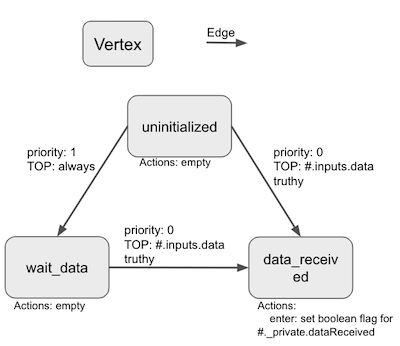

# Abstract Process Model
[<- back to Holarchy](../README.md)

<!-- reference -->
[arccore filter]: https://encapsule.io/docs/ARCcore/filter
[arccore identifier]: https://encapsule.io/docs/ARCcore/identifier
[arccore graph]: https://encapsule.io/docs/ARCcore/graph
[ocd]: ./observable-controller-data.md
[opc]: ./observable-process-controller.md
[apm]: ./abstract-process-model.md
[top]: ./transition-operator.md
[top list]: ../transition-operator-apis.md
[act]: ./controller-action.md
[act list]: ../controller-action-apis.md
[cp]: ./cell-procssor.md
[cm]: ./cell-model.md

* [Construction](#Construction)
* [APM ES6 Class APIs](#APM-ES6-Class-APIs)
* [Internal Notes](#internal-notes)

Abstract Process Model (APM) is an ES6 class instantiated withoperator new that represents the shared memory and runtimebehavior(s) of a cell process abstractly (i.e. the means by which anything that an AbstractProcessModel describes is actually orchestrated/executed is not directly specified by an AbstractProcessModel). 

APM specifically model the required/expected behaviors of a runtime cell process by allowing developers to declare orchestration rules and runtime side-effects (e.g. data transoformation alogorithms) in terms of a hybrid Finite State Machine (FSM) model.

APM is also the basis for [Cell Model][cm]. An APM instance or declaration is required for a valid [Cell Model][cm].

# Construction
To create an APM instance:
```javascript
const holarchy = require("@encapsule/holarchy");

const apmInstance = new holarchy.AbstractProcessModel({
    id: "your_unique_apm_irut_id",
    name: "your_apm_name",
    description: "apm_description",

    ocdDataSpec: {
        // object for ocd construction
    },

    steps: {
        // stepName: stepDescriptor
    }
});
```
* *id*: an unique irut. It can be generated with [arccore filter][arccore filter].
* *name* and *description*: information for the apm
* *ocdDataSpec*: a filter spec to construct an OCD instance. Please refer to [Observable Controller Data][ocd] for more information.
* *steps*: A Finite State Machine (FSM) model that defines the core runtime behavior(s) of a cell process. 

## *steps*
*Steps* is a Finite State Machine (FSM) model that defines the core runtime behavior(s) of a cell process. It can be understand as a collection of descriptors that defines APM's transition and action corresponding to that transition. Below is an example:

```javascript
const holarchy = require("@encapsule/holarchy");

const apmInstance = new holarchy.AbstractProcessModel({
    id: "your_unique_apm_irut_id",
    name: "your_apm_name",
    description: "apm_description",

    ocdDataSpec: {
        ____types: "jsObject",
        ____defaultValue: {},
        inputs: {
            ____types: "jsObject",
            ____defaultValue: {},
            data: {
                ____accept: ["jsUndefined", "jsObject"]
            }
        },
        _private: {
            ____types: "jsObject",
            ____defaultValue: {},
            dataReceived: {
                ____types: "jsBoolean",
                ____defaultValue: false
            }
        }
    },

    steps: {
        // step descriptor uninitialized
        uninitialized: {
            description: "default start step",
            actions: { // optional
                enter: [],
                exit: []
            },
            transitions: [
                {   
                    // holarchy built-in TOP
                    transitionIf: { holarchy: {cm: {operators: {ocd: {isNamespaceTruthy: {path: "#.inputs.data"}}}}}},
                    nextStep: "data_received"
                },
                {
                    transitionIf: { always: true },
                    nextStep: "wait_for_data"
                }
            ]
        },
        wait_for_data: {
            description: "wait for someone to write data into #.inputs.data",
            transitions: [
                {
                    transitionIf: { holarchy: {cm: {operators: {ocd: {isNamespaceTruthy: {path: "#.inputs.data"}}}}}},
                    nextStep: "data_received"
                },
            ]
        },
        data_received: {
            description: "received data from someone",
            actions: {
                enter: [
                    // holarchy built-in ACT
                    {holarchy: {cm: {actions: {ocd: {setBooleanFlag: {path: "#._private.dataReceived"}}}}}}
                ]
            }
        }

    }
});
```

In the *steps*, each step descriptor:
* use its step name as key
* MUST have the step - *uninitialized*
* key:value, value is step descriptor
    * *description*: describe the step
    * *transitions*: a collection of conditions define which step APM will transit. The order represents the priority of condition
        * *transitionIf*: a registered [Transition Operator][top]. For a list of built-in TOPs in holarchy, please check the [Transition Operator List][top list]
        * *stepName*: a registered step name in this APM that APM will transit to if above TOP return true
    * *actions*: two collections (*enter* and *exit*) of [Controller Action][act] that will be perform when the APM enter or exist the step respectively. Please check [Controller Action List][act list] for holarchy built-in Controller Actions.

For the above example, the *steps* tells APM that:
always start at uninitialized
* unitialized:
    * go to wait_for_data if #.inputs.data is undefined (evaluate first)
    * go to data_received if #.inputs.data is not undefined (evaluate second)
* wait_for_data
    * go to data_received if #.inputs.data is not undefined
* data_received:
    * at enter this step, change the #._private.dataReceived to true

# APM ES6 Class APIs
| Method | Description |
|-|-|
| .isValid() | check whether the current APM instance is valid or not. Return true or false |
| .toJSON() | Convert the APM isntance into an JSON object | 
| .getID() | get APM ID for this APM |
| .getVDID() | get VDID (a runtime created irut during construction) for this APM instance. Different from instance to instance |
| .getName() | get APM *name* for this APM |
| .getDescription() | get APM *description* for this APM |
| .getDataSpec() | get APM *ocdDataSpec* for this APM |
| .getStepDescriptor(stepName_) | get the value under the stepName_ in *steps* for this APM |

# Internal Notes
The APM is actually a graph. Each step in the *steps* will be a vertex with transitions **from** it as edges. APM doesn't construct its *ocdDataSpec* into OCD instance, so it doesn't require OCD init data during construction. It is the [OPC][opc]'s job to use the spec to construct an instance at runtime.

Because APM is a graph. This is another public method not included above - .getDigraph()



## Construction
Below happens during an APM instance construction:
1. create an [arccore filter][arccore filter] with *ocdDataSpec* to validate it.
2. create a graph with [arccore graph][arccore graph]
    * add vertext with key, *description* and *actions* of each step in *steps*
    * add edge with *transitions* for each step (Notice the priority is regarding to the vertex the edge is from.)
```javascript
const apmDigraph = empty_graph_created_with_arccore;

//vertex
apmDigraph.addVertex({
    u: step_name, // key of step in steps
    p: {
        description,
        actions, // actions from the step, both enter and exit
    }
});

// edge
apmDigraph.addEdge({
    e: {
        u: step_name,
        v: nextStep_in_one_of_transition
    },
    p: {
        priority: order_of_transition_transitions
        operator: transitionIf_TOP
    }
})

```

## .getDigraph()
Return above APM digraph